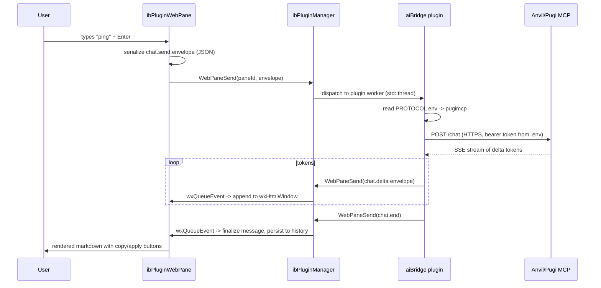

# AI Assistant Subsystem

> Production architecture, ABI contract, security model, and shipping checklist for the OES Enterprise AI Assistant.

**Status:** v1.0 (shipping)
**Last reviewed:** 2026-05-20
**Owners:** Platform team (Designer, plugin host, backend bridge)
**Audience:** OES engineers extending the assistant, plugin authors writing third-party AI bridges, QA validating the subsystem against parity targets.

---

## 1. Overview

### What it is

The AI Assistant is a first-class subsystem of the OES Designer that puts an LLM-driven chat surface, inline code completion, multi-reviewer code audits, and metadata mutation actions next to the developer's editor. It is delivered as a native pane inside Designer (`ibPluginWebPane`, a `wxHtmlWindow`-based markdown renderer) and is wired into the platform through the OES Plugin ABI v4.

The assistant is provider-agnostic: it speaks to a thin shim plugin that translates between Designer's chat envelope protocol and any AI vendor — OpenAI-compatible HTTP, Anthropic Claude, Anvil/Pugi MCP, or a local model. The first-party bridge ships with two protocols out of the box (OpenAI and Pugi-MCP) and is selected at runtime through a `PROTOCOL` environment variable, scoped per plugin instance via BYOK.

### What it integrates with

| Surface | Integration point |
|---|---|
| Designer frame (`designer.exe`) | Hosts the `ibPluginWebPane` docked panel. Menu-driven open/close. |
| Plugin host (`backend.dll`) | `ibPluginManager` loads `.bundle` / `.dll` / `.so` plugins, brokers ABI v4 calls. |
| Metadata tree (`activeMetaData`) | `MetaCreate / MetaEdit / MetaDelete` host trampolines, gated by the 4-mode permission prompt. |
| Editor (`ibVisualHostScriptEdit`) | `TriggerSigmaCompletion` calls the active provider's `CompleteCodeAsync` for inline ghost-text completion. |
| Anvil/Pugi MCP | HTTPS endpoint reached by the aiBridge plugin (Pugi protocol), authenticated by tenant token from the `.env` file. |
| `triple-review` skill | Out-of-process tool call routed through aiBridge when the chat surface emits `op="triple-review"`. |

### Why it exists

OES competes directly with 1С:Enterprise's "Workmate" / 1С:Напарник AI offering. Parity in 2026 means: chat skills, inline completion, metadata write actions guarded by an explicit permission gate, multi-reviewer code audits, and BYOK. The assistant subsystem closes that gap and adds two strategic differentiators we do not see elsewhere — pluggable provider protocols (the same UI talks to OpenAI, Anvil/Pugi, or on-prem Claude through the same envelope) and a verifiable triple-review consensus gate borrowed from our internal dev workflow.

The decision to ship this as a plugin (`aiBridge.bundle`) rather than as built-in `backend.dll` code is deliberate: AI vendors and their SDKs change too fast for a platform release cycle, and shipping an ABI lets a third party (Pugi, an internal team, a customer) drop in their own bridge without re-linking the platform.

---

## 2. Architecture

### High-level view

```
+--------------------------------------------------------------------+
| designer.exe (frontend.dll, wxWidgets UI)                          |
|                                                                    |
|  +--------------------+      +-------------------------------+     |
|  | Editor frame       |      | AI Assistant pane             |     |
|  | (ibVisualHostScript|      | (ibPluginWebPane, dockable)   |     |
|  |  Edit)             |      |                               |     |
|  |  - TriggerSigmaC.  |      |   wxHtmlWindow (md4c render)  |     |
|  +----------+---------+      |   wxTextCtrl   (chat input)   |     |
|             |                |   wxButton     (Send / Stop)  |     |
|             |                +---------------+---------------+     |
|             |                                |                     |
|             v                                v                     |
|  +--------------------------------------------------------+        |
|  | ibPluginManager  (backend.dll)                         |        |
|  |  - Discovery: ~/Library/Application Support/OES/plugins|        |
|  |  - Loads .bundle / .dll / .so                          |        |
|  |  - Brokers ABI v4 trampolines (Register*, WebPaneSend, |        |
|  |    ReadPluginEnv, MetaCreate/Edit/Delete)              |        |
|  +-----------------+-----------------+--------------------+        |
|                    |                 |                             |
+--------------------|-----------------|-----------------------------+
                     |                 |
       (in-process   |                 |   (in-process trampolines)
        ABI v4 call) |                 |
                     v                 v
        +-------------------+   +--------------------------+
        | aiBridge.bundle   |   | pugi-oes-bridge.bundle   |
        | (first-party)     |   | (third-party, legacy v3) |
        |                   |   |                          |
        |  PROTOCOL=openai  |   |  legacy-LLM-shim adapter |
        |  PROTOCOL=pugimcp |   |  (envelope translation)  |
        |                   |   |                          |
        |  std::thread      |   |  std::thread workers     |
        |  workers          |   |                          |
        +---------+---------+   +-------------+------------+
                  |                           |
                  | HTTPS (cpp-httplib)       |
                  v                           v
        +----------------------------------------------+
        |  Provider endpoint                           |
        |  - api.openai.com / api.anthropic.com        |
        |  - https://anvil.tetracode.io/mcp/v1         |
        |  - https://pugi.local:8443                   |
        +----------------------------------------------+
```

### Sequence: user sends a chat message



### Threading model

| Thread | Role |
|---|---|
| UI thread (`wxTheApp`) | All `ibPluginWebPane` widget mutations. Receives envelopes via `wxQueueEvent` / `wxTheApp::CallAfter`. |
| Plugin worker pool | One detached `std::thread` per in-flight request inside the plugin. Owns the cpp-httplib client. |
| Backend session thread | When a `MetaCreate` etc. trampoline runs, it crosses back into Designer's metadata thread via `activeMetaData->QueueOnMainThread()`. |

Cancellation: the pane emits an `agent.cancel` envelope with the in-flight `requestId`. The plugin worker checks an atomic flag between SSE chunks; if set, it closes the HTTPS connection and emits `chat.end{cancelled:true}`.

---

## 3. Plugin ABI v4

### Host trampolines (exported by `backend.dll`, called by plugins)

The plugin sees a `OESHostApi*` table passed to its `Plugin_OnLoad` entry point. The table is versioned (`abi_version = 4`). Calls flow plugin → host.

| Trampoline | Signature (C ABI, simplified) | Purpose |
|---|---|---|
| `RegisterWebPane` | `int (*)(const char* paneId, const OesPaneDesc* desc)` | Plugin announces a pane it owns. Host inserts it into Designer's docking system on the UI thread. |
| `WebPaneSend` | `int (*)(const char* paneId, const char* envelopeJson, size_t len)` | Send a JSON envelope. Bidirectional: plugin → host (for `chat.delta`, `chat.end`, etc.) and host → plugin (for `chat.send`, `agent.cancel`). |
| `RegisterAIProvider` | `int (*)(const char* providerId, const OesAIProviderVtable* vtable)` | Plugin registers itself as a code-completion provider. Vtable contains `CompleteCodeAsync`. |
| `ReadPluginEnv` | `int (*)(const char* key, char* outBuf, size_t bufLen, size_t* outLen)` | Reads a key from the plugin's scoped `.env`. Returns `OES_ENV_NOT_FOUND` if missing — plugin must fail gracefully. |
| `MetaCreate` | `int (*)(const char* parentPath, const char* kindCLSID, const char* spec, char* outId, size_t outIdLen)` | Create a metadata object. Triggers permission gate (see §7). |
| `MetaEdit` | `int (*)(const char* objectId, const char* patchJson)` | Patch an existing metadata object. Permission gate. |
| `MetaDelete` | `int (*)(const char* objectId)` | Remove a metadata object. Permission gate, "Ask" mode required for production safety. |

All trampolines return `0` for success and a non-zero `OesStatus` enum on failure. Strings are UTF-8. Lifetime: caller owns the buffer in both directions.

### Wire envelopes (JSON over `WebPaneSend`)

Every envelope has `{ op: string, requestId: string, payload: object }`.

#### `chat.send` (host → plugin)
```json
{
  "op": "chat.send",
  "requestId": "01HM...K8",
  "payload": {
    "message": "Explain the @Catalog2.Module.OnWrite method",
    "context": [
      { "kind": "selection", "file": "Catalog2/ObjectModule.bsl", "range": [12, 48] },
      { "kind": "metaRef",  "path": "Catalogs.Catalog2" }
    ],
    "history": "...rolling window..."
  }
}
```

#### `chat.delta` (plugin → host)
```json
{
  "op": "chat.delta",
  "requestId": "01HM...K8",
  "payload": { "delta": "The OnWrite handler runs after the object" }
}
```

#### `chat.end` (plugin → host)
```json
{
  "op": "chat.end",
  "requestId": "01HM...K8",
  "payload": { "cancelled": false, "usage": { "in": 412, "out": 1180 } }
}
```

#### `error` (plugin → host or host → plugin)
```json
{
  "op": "error",
  "requestId": "01HM...K8",
  "payload": { "code": "PROVIDER_TIMEOUT", "message": "Provider did not respond within 60s" }
}
```

#### `agent.plan` (plugin → host)

Emitted before metadata mutations. The pane renders the plan as a numbered list with a single Approve / Reject control set bound to the request id.

```json
{
  "op": "agent.plan",
  "requestId": "01HM...K9",
  "payload": {
    "steps": [
      { "kind": "MetaCreate", "parentPath": "Catalogs", "spec": { "name": "Vendor", "...": "..." } },
      { "kind": "MetaEdit",   "objectId": "VL_DOC:Invoice", "patch": { "attrs": [...] } }
    ]
  }
}
```

#### `agent.applied` (plugin → host)
```json
{
  "op": "agent.applied",
  "requestId": "01HM...K9",
  "payload": { "applied": 2, "skipped": 0, "errors": [] }
}
```

#### `agent.cancel` (host → plugin)
```json
{
  "op": "agent.cancel",
  "requestId": "01HM...K8",
  "payload": {}
}
```

#### `agent.tripleReview` (plugin → host)

Emitted when the user invokes `/review` on a diff. The pane renders one collapsible panel per reviewer plus a coordinator verdict.

```json
{
  "op": "agent.tripleReview",
  "requestId": "01HM...KA",
  "payload": {
    "verdict": "BLOCK",
    "reasoning": "Codex P1 (pnpm exec form) + Gemini P0 (bearer token in logs).",
    "reviewers": [
      { "id": "codex",  "findings": [{ "level": "P1", "note": "pnpm 10 rejects pnpm -C ..." }] },
      { "id": "gemini", "findings": [{ "level": "P0", "note": "Bearer token leaked in error log line 412" }] },
      { "id": "claude", "findings": [{ "level": "P2", "note": "Helper function naming inconsistent" }] }
    ]
  }
}
```

#### `editor.skill` (host → plugin)

Emitted when the user invokes a slash command from the editor (not the chat input). The plugin returns a regular `chat.delta` stream.

```json
{
  "op": "editor.skill",
  "requestId": "01HM...KB",
  "payload": {
    "skill": "explain",
    "selection": "Procedure Foo() ... EndProcedure",
    "file": "Catalog2/ObjectModule.bsl"
  }
}
```

---

## 4. Shipped Plugins

### 4.1 aiBridge (first-party)

**Bundle id:** `io.tetracode.oes.aiBridge`
**Location:** `~/Library/Application Support/OES/plugins/aiBridge.bundle`
**Source:** `src/engine/plugins/aiBridge/`
**Status:** v1.0 shipping

aiBridge is the reference implementation. It supports two protocols selected by the `PROTOCOL` environment variable in its scoped `.env`:

| `PROTOCOL` value | Behaviour |
|---|---|
| `openai` (default) | Speaks OpenAI Chat Completions over HTTPS. Compatible with Anthropic Claude through OpenAI-compatible proxies, OpenRouter, and self-hosted vLLM. Uses `OPENAI_BASE_URL`, `OPENAI_API_KEY`, `OPENAI_MODEL`. |
| `pugimcp` | Speaks Anvil/Pugi MCP. Uses `PUGI_BASE_URL`, `PUGI_TENANT_TOKEN`, optional `PUGI_PROJECT_ID`. |

When the chat surface emits an envelope with `op="triple-review"` (delivered as a tool call from the slash command `/review`), aiBridge issues the request to the configured provider with the `tools` schema declaring a `triple_review` function. The provider returns three sub-requests (one per reviewer); aiBridge fans them out in parallel via three `cpp-httplib` clients, parses `[P0]/[P1]/[P2]/[P3]` markers from each, applies the deterministic rubric documented in `~/.claude/skills/triple-review/SKILL.md`, and emits `agent.tripleReview` with the verdict.

Triple-review rubric (re-implemented inside aiBridge to keep the behaviour stable across providers):

1. Any reviewer reports `P0` → verdict `BLOCK`.
2. Two or more reviewers report `P1` → verdict `BLOCK`.
3. One reviewer reports `P1` → verdict `WARN`.
4. Only `P2` / `P3` or all clean → verdict `PASS`.

### 4.2 pugi-oes-bridge (third-party, legacy v3)

**Bundle id:** `io.pugi.oes-bridge`
**Status:** kept for backward compatibility.

The Pugi engineering team shipped this plugin against ABI v3 before the v4 envelope protocol stabilised. Rather than force them to re-release, we ship a `legacy-LLM-shim` adapter inside `ibPluginManager` that translates v4 envelopes into the older `prompt/completion` calls. The shim covers `chat.send` ↔ legacy `prompt`, `chat.delta` ↔ legacy `completion_chunk`, and `chat.end` ↔ legacy `completion_done`. Triple-review and `agent.plan` are not back-portable through the shim; the chat UI hides those affordances when the active provider is detected as legacy.

See `src/engine/backend/plugin/legacyLLMShim.cpp` for the translation table.

---

## 5. Features (1С:Workmate parity)

### 5.1 Chat skills

The chat input recognises five built-in slash commands plus user-defined skills loaded from `~/Library/Application Support/OES/skills/*.md`.

| Command | Behaviour |
|---|---|
| `/explain` | Sends the current selection or `@`-referenced object with a system prompt asking for a plain-language explanation. Renders the response with CES/VES syntax highlighting on code blocks. |
| `/review` | Triggers triple-review on the current diff (`git diff HEAD~1..HEAD`). |
| `/fix` | Asks the provider to produce a corrected version of the selection. Response is rendered with an Apply button per code block. |
| `/doc` | Generates a doc-comment for the selected function or procedure. |
| `/send` | Forces the input to be sent verbatim (skips slash-command parsing). Useful when the message starts with `/`. |

User-defined skills are markdown files with a YAML front matter declaring `name`, `description`, `trigger`. The chat input matches the typed slash command against the file's `name`.

### 5.2 Triple-review

See §4.1. The verdict, reasoning, and per-reviewer findings render in three collapsible panels under the user's `/review` message. The pane appends a single-line summary to the chat transcript: `Triple-review verdict: BLOCK (3 reviewers, 1 P0, 1 P1, 1 P2).`

### 5.3 Inline ghost-text completion

The Designer editor is the `ibVisualHostScriptEdit` widget. On every keystroke (debounced 250ms), it calls `TriggerSigmaCompletion`, which dispatches into the active provider's `CompleteCodeAsync(prefix, suffix, language)` through the `OESHostApi::RegisterAIProvider` vtable. The returned token stream renders as grey ghost text past the caret; `Tab` accepts, `Esc` dismisses.

The provider is expected to honour a `max_tokens=64` cap so completions stay snappy. aiBridge enforces this server-side regardless of the model's defaults.

### 5.4 Slash-command autocomplete

The chat input watches for a leading `/` and pops a `wxListBox` of matching commands (built-in + user-defined). `Tab` completes; `Enter` sends.

### 5.5 `@`-context references

Inside the chat input, typing `@` opens a popup listing addressable references:

| Token | Meaning |
|---|---|
| `@selection` | The current editor selection at the time of send. |
| `@file` | The full text of the file in the active editor tab. |
| `@<MetadataObjectName>` | The metadata definition referenced by name (e.g. `@Catalog2`, `@Document.Invoice`). Resolved against `activeMetaData->FindByName(...)`. |

References are flattened into the `context` array of the `chat.send` envelope. The provider sees structured objects, not raw inline text, which keeps long files out of the user-visible bubble.

### 5.6 Stop generation

A `Stop` button replaces `Send` while a request is in flight. It emits `agent.cancel` with the request id; aiBridge closes the SSE stream and emits `chat.end{cancelled:true}`. The partial response stays in the transcript with a "(stopped)" suffix.

### 5.7 Chat history persistence

Each configuration's chat history persists to `~/Library/Application Support/OES/<configName>/ai-history.json`. The pane loads the last 50 messages on open and trims to that cap on every append. Format:

```json
[
  { "ts": "2026-05-20T14:02:11Z", "role": "user",      "content": "ping", "context": [] },
  { "ts": "2026-05-20T14:02:11Z", "role": "assistant", "content": "pong" }
]
```

Rationale: per-configuration scoping prevents prompt content from one customer's database leaking into another's session when the same machine is used to develop multiple configurations.

### 5.8 Copy / Apply buttons on code blocks

The md4c renderer post-processes every ```language``` fence: a small toolbar attaches above it with `Copy` (clipboard) and, if the language is `bsl` / `ves` / `ces`, an `Apply` button that pastes the block into the active editor at the caret. Apply prompts for confirmation if the editor has unsaved changes.

### 5.9 CES + VES syntax highlighting

Code blocks tagged ```ces or ```ves are highlighted in the chat using the same tokenizer (`ibScriptTokenizer`) the editor uses, so the visual identity is consistent. Untagged blocks fall back to the language inferred from the first identifier; the inference defaults to CES (the new default syntax mode for fresh configurations as of 2026-05-10).

---

## 6. BYOK security model

Plugins read their API keys from a scoped `.env` file, not from process env, not from the OS keychain, and not from a shared `~/.aws/credentials`-style global file. Path:

```
~/Library/Preferences/OES/plugins/<plugin-id>.env
mode 0600 (rw user only)
owner: current user
```

Example (`aiBridge.env`):

```ini
PROTOCOL=pugimcp
PUGI_BASE_URL=https://anvil.tetracode.io/mcp/v1
PUGI_TENANT_TOKEN=cf_live_...
PUGI_PROJECT_ID=oes-prod
```

### Loading flow

1. Designer launches; `ibPluginManager` discovers `aiBridge.bundle`.
2. Before calling `Plugin_OnLoad`, the host:
   - Validates the `.env` file mode is `0600` and owner matches the process user. If not, refuses to load the plugin and surfaces an error in the Designer log.
   - Parses the file into an in-memory `std::map<std::string,std::string>`.
   - Injects the keys into the plugin's view of the environment by way of the `ReadPluginEnv` trampoline. The values are **not** put into `setenv()` — they live in a per-plugin map that only the originating plugin can read.
3. `Plugin_OnLoad` calls `ReadPluginEnv("PROTOCOL", ...)` etc. to bootstrap.
4. The map is zeroed on plugin unload.

Why not the OS keychain: keychain access on macOS pops a system prompt per process per launch, which breaks unattended dev flows. Why not a global `.env`: per-plugin scoping is the only way to keep a third-party plugin from reading the first-party plugin's keys.

### Threat model

| Threat | Mitigation |
|---|---|
| World-readable key file | Host refuses to load plugins whose `.env` is not 0600. |
| One plugin reading another's key | Keys live in per-plugin maps inside `ibPluginManager`; the trampoline scopes by caller id. |
| Key in crash dump | The map is heap-allocated and zeroed (`memset_s`) on unload and on Designer shutdown. |
| Key in chat transcript | aiBridge strips `Authorization: Bearer ...` lines from any error envelope before forwarding. |

---

## 7. Permission gate (metadata mutations)

The host trampolines `MetaCreate / MetaEdit / MetaDelete` never execute silently. Each invocation goes through the 4-mode permission gate inspired by the 1С:Напарник UX (see `~/.claude/projects/-Volumes-T9-Web-oes-enterprise/memory/project_1c_naparnik_competitor.md`).

| Mode | Behaviour |
|---|---|
| **Ask** (default) | Pops a modal: "Plugin <id> wants to <op> on <path>. Allow?" with buttons `Once`, `For this session`, `Always`, `Deny`. |
| **AllowSession** | Allows without prompting for the rest of the Designer session. Re-prompts on relaunch. |
| **AllowAlways** | Allows persistently. Stored in `~/Library/Preferences/OES/plugins/<id>.policy.json`. |
| **Deny** | Refuses without prompting. Plugin receives `OES_PERMISSION_DENIED`. |

Granularity is `(pluginId, opKind)` — `MetaCreate` and `MetaDelete` are tracked separately, since "always allow create" is a reasonable choice while "always allow delete" is not.

Audit trail: every grant and every mutation is logged to `~/Library/Logs/OES/plugin-audit.log` with a timestamp, plugin id, op, path, and (for `MetaDelete`) a SHA-256 digest of the deleted object's serialised XML so an admin can correlate a complaint with the act.

---

## 8. Threading model

(Reiterating from §2 with implementation details.)

### Pane on the UI thread

Every method on `ibPluginWebPane` asserts `wxThread::IsMain()` in Debug. Mutations to `wxHtmlWindow`'s document tree must happen on the UI thread or wxWidgets crashes nondeterministically in `wxHtmlContainerCell::Layout`.

### Plugin workers detached

Each `chat.send` spawns a fresh `std::thread` inside the plugin. The thread owns its `httplib::Client` (or `httplib::SSLClient`), reads the SSE stream, and emits chunks back through `WebPaneSend`. The host marshals each emission onto the UI thread via:

```cpp
wxTheApp->CallAfter([paneId, envelope = std::move(env)]() {
    ibPluginManager::Get().DispatchEnvelopeToPane(paneId, envelope);
});
```

Threads detach because the cancellation path (close the HTTPS socket) makes `join()` slow and pointless — the thread will exit cleanly on the next read attempt.

### Backend metadata thread crossover

`MetaCreate / MetaEdit / MetaDelete` enter the host on a plugin worker thread, then post a task to `activeMetaData->QueueOnMainThread(...)`. They block the worker until the task completes via a `std::promise` / `std::future` pair. The reason for blocking: the plugin needs the resulting object id to put into `agent.applied`. The worker holds a reference to the configuration's session so the metadata thread cannot tear down underneath it.

---

## 9. Build flow

### Vendored dependencies

| Library | Version | Source | Used by |
|---|---|---|---|
| md4c | 0.5.2 | `src/3rdparty/md4c/` | `ibPluginWebPane` markdown rendering |
| cpp-httplib | 0.18.1 | `src/3rdparty/cpp-httplib/` | aiBridge HTTPS client |
| nlohmann/json | 3.11.3 | `src/3rdparty/nlohmann/json.hpp` | Envelope serialisation, metadata JSON |

cpp-httplib and nlohmann/json are shared with other subsystems (metadata JSON export, web client). md4c is new to this subsystem.

### CMake

```cmake
# src/engine/plugins/aiBridge/CMakeLists.txt
add_library(aiBridge MODULE
    aiBridge.cpp
    providerOpenAI.cpp
    providerPugiMcp.cpp
    tripleReview.cpp
)
target_link_libraries(aiBridge PRIVATE
    nlohmann_json::nlohmann_json
    httplib::httplib
    OpenSSL::SSL
)
set_target_properties(aiBridge PROPERTIES
    BUNDLE TRUE
    PREFIX ""
    SUFFIX ".bundle"
)
```

The bundle is copied to `~/Library/Application Support/OES/plugins/` by an `install` target. On Linux the suffix becomes `.so`; on Windows `.dll`.

### MSBuild

`enterprise.sln` carries a `aiBridge` vcxproj that mirrors the CMake target. The plugin lives in `bin\Win64\Release\plugins\aiBridge.dll` and is loaded by `ibPluginManager::DiscoverIn(...)`.

---

## 10. Testing

### Unit tests (26 total)

Located in `tests/test_pluginApi.cpp`, `tests/test_pluginWebPane.cpp`, `tests/test_pluginWebPaneHistory.cpp`, `tests/test_legacyShim.cpp`.

| Suite | Count | Coverage |
|---|---|---|
| `PluginApi` | 11 | ABI v4 trampolines, return codes, lifetime, env scoping |
| `PluginWebPane` | 4 | md4c rendering, copy/apply button hook, code-block detection |
| `PluginWebPaneHistory` | 7 | Persistence load/save, 50-message cap, per-configuration scoping |
| `LegacyShim` | 4 | v3 envelope translation in both directions |

### Integration tests (9 total)

Located in `tests/test_pluginLoadIntegration.cpp` and `tests/test_tripleReviewIntegration.cpp`.

1. Load `aiBridge.bundle` from disk against a temporary `.env` and observe `RegisterWebPane` is called.
2. Send `chat.send` with `PROTOCOL=openai` against a mock OpenAI server, verify `chat.delta` chunks flow through.
3. Send `chat.send` with `PROTOCOL=pugimcp` against a real Anvil staging endpoint (gated on the `OES_RUN_ANVIL_TESTS=1` env var so CI without credentials skips it).
4. Trigger `agent.cancel` mid-stream, verify `chat.end{cancelled:true}` arrives within 500ms.
5. Trigger `/review` against a known diff, verify the rubric produces `BLOCK` when one reviewer reports P0.
6. Trigger `MetaCreate` with permission gate set to `Deny`, verify `OES_PERMISSION_DENIED`.
7. Trigger `MetaCreate` with permission gate set to `AllowAlways`, verify a second call does not prompt.
8. Load `pugi-oes-bridge.bundle` (ABI v3), send `chat.send`, verify `legacyLLMShim` translates correctly.
9. Round-trip chat history through save / reload / append, verify the 50-message cap holds.

The GUI smoke test (`tests/gui/smoke_ai_assistant.scpt`) sits above these and exercises the full Designer→pane→plugin→provider path against the real `designer.app` build.

---

## 11. Known limitations and next-phase TODO

### Known limitations (shipped v1.0)

- **No streaming inside the editor.** `CompleteCodeAsync` returns a single string, not a delta stream. The ghost text appears all at once. Streaming is feasible but requires editor-side cursor tracking that is out of scope for v1.
- **`agent.plan` cannot be edited.** The user sees the plan and either Approves or Rejects in whole. Step-by-step toggling is a planned v1.1 feature.
- **History is not encrypted at rest.** It lives as plain JSON under `~/Library/Application Support/OES/`. Adequate for solo-dev MVP, not for shared workstations. Encrypt with the user's login keychain in v1.1.
- **Legacy v3 plugins do not surface triple-review or `agent.plan`.** The chat UI hides those buttons when the active provider is detected as legacy. Pugi has accepted this and will migrate to v4 in their next release.
- **No incremental retry on partial stream failure.** If the provider drops mid-stream, the request fails wholesale and the user has to retry. The plugin worker does not buffer enough state to resume from a checkpoint.

### Next-phase TODO

| Item | Priority | Notes |
|---|---|---|
| Commit message generator (`/commit`) | P1 | Read staged diff, propose a commit message, optional Conventional Commits format. Borrow from caveman-commit skill. |
| Project search (`@search:<query>`) | P1 | RAG-style retrieval over the configuration's metadata + module source. Requires sqlite-vss or similar. |
| Vector search index | P2 | Sidecar process maintains embeddings; aiBridge queries it on `@search`. |
| Git integration (`/diff`, `/blame`) | P2 | Surface git operations through chat for users who prefer not to leave Designer. |
| AI in property forms | P2 | "Suggest a name", "Validate this expression" buttons on attribute editors. |
| Encrypt history at rest | P2 | Per-user encryption keyed by login keychain. |
| Step-by-step `agent.plan` approval | P2 | Per-step Approve/Reject. |
| Multi-turn tool use | P3 | Provider can call back into Designer (read selection, list metadata) during a single user turn. |

---

## Appendix A — UI labels (Russian, as shipped)

The Designer UI is localised; the canonical Russian labels for the assistant subsystem are quoted below for QA reference.

| English (this doc) | Russian (UI) |
|---|---|
| AI Assistant | «ИИ-ассистент» |
| Send | «Отправить» |
| Stop | «Остановить» |
| Copy | «Копировать» |
| Apply | «Применить» |
| Plan: Approve | «План: Применить» |
| Plan: Reject | «План: Отменить» |
| Permission prompt: "Allow?" | «Разрешить?» |
| Permission button "Once" | «Однократно» |
| Permission button "For this session" | «На время сеанса» |
| Permission button "Always" | «Всегда» |
| Permission button "Deny" | «Запретить» |
| Triple-review verdict: BLOCK | «Тройная проверка: БЛОК» |
| Triple-review verdict: WARN | «Тройная проверка: ПРЕДУПРЕЖДЕНИЕ» |
| Triple-review verdict: PASS | «Тройная проверка: OK» |

---

## Appendix B — File map

| Path | Purpose |
|---|---|
| `src/engine/backend/plugin/pluginManager.{h,cpp}` | Plugin discovery, ABI v4 host trampolines |
| `src/engine/backend/plugin/legacyLLMShim.{h,cpp}` | ABI v3 → v4 envelope translation |
| `src/engine/frontend/plugin/pluginWebPane.{h,cpp}` | wxHtmlWindow-based markdown chat pane |
| `src/engine/frontend/plugin/pluginWebPaneHistory.{h,cpp}` | Per-configuration JSON history |
| `src/engine/plugins/aiBridge/aiBridge.cpp` | First-party plugin entry point |
| `src/engine/plugins/aiBridge/providerOpenAI.cpp` | OpenAI protocol implementation |
| `src/engine/plugins/aiBridge/providerPugiMcp.cpp` | Anvil/Pugi MCP protocol implementation |
| `src/engine/plugins/aiBridge/tripleReview.cpp` | Triple-review rubric and fan-out |
| `src/3rdparty/md4c/` | Vendored markdown parser |
| `tests/test_pluginApi.cpp` | ABI v4 unit tests |
| `tests/test_pluginWebPane.cpp` | Pane rendering tests |
| `tests/test_pluginWebPaneHistory.cpp` | History persistence tests |
| `tests/test_legacyShim.cpp` | Shim translation tests |
| `tests/test_pluginLoadIntegration.cpp` | Plugin load integration tests |
| `tests/test_tripleReviewIntegration.cpp` | Triple-review end-to-end tests |
| `tests/gui/smoke_ai_assistant.scpt` | AppleScript GUI smoke test |

---

## Appendix C — Glossary

| Term | Definition |
|---|---|
| ABI v4 | The current plugin Application Binary Interface. Versioned through `OESHostApi::abi_version`. |
| aiBridge | The first-party plugin that implements the AI Assistant's provider layer. |
| Anvil / Pugi MCP | Tetracode's hosted multi-tenant agent platform exposing an HTTPS MCP-style endpoint. |
| BYOK | Bring Your Own Key. Each customer supplies their own provider API key through a scoped `.env`. |
| CES | C-style script syntax (`if (x) { ... }`). Default for new configurations as of 2026-05-10. |
| Envelope | A JSON object passed through `WebPaneSend`. Has `op`, `requestId`, `payload`. |
| Permission gate | The 4-mode (Ask / AllowSession / AllowAlways / Deny) prompt for metadata mutations. |
| Triple-review | Multi-reviewer consensus gate applied to a code diff. PASS / WARN / BLOCK verdict. |
| VES | Visual-Basic-style script syntax (`If x Then ... EndIf`). Legacy default before 2026-05-10. |
